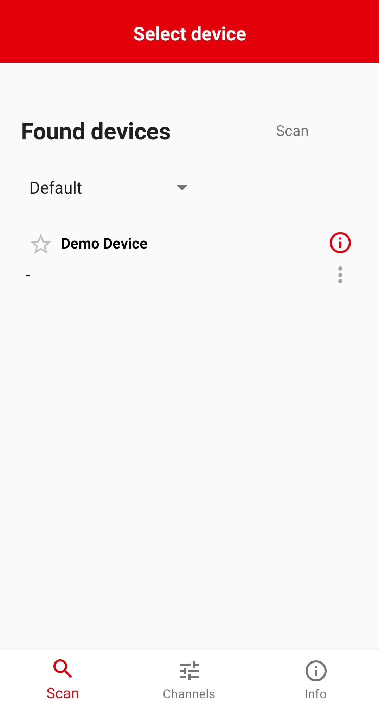
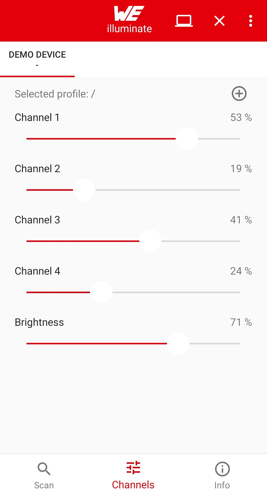
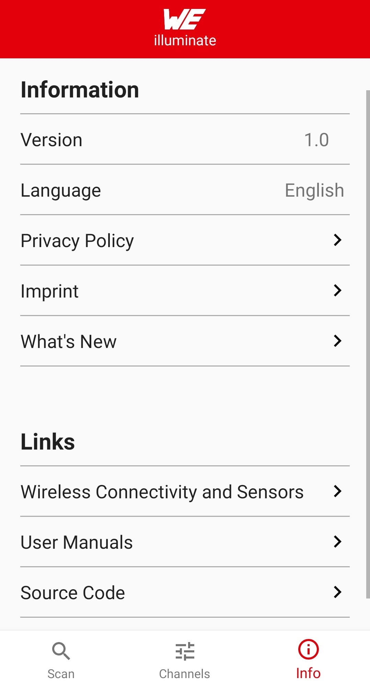
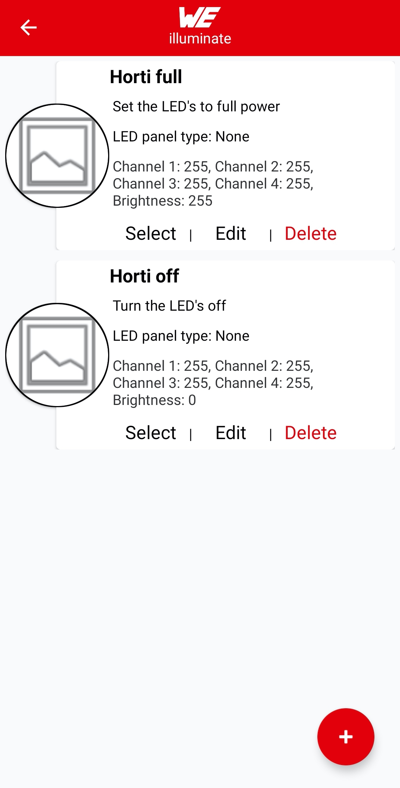
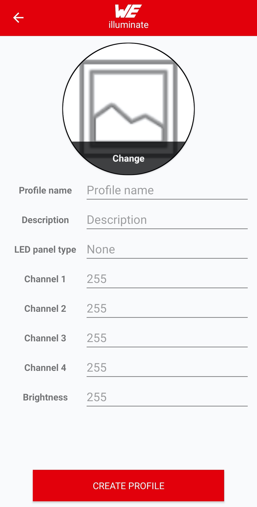
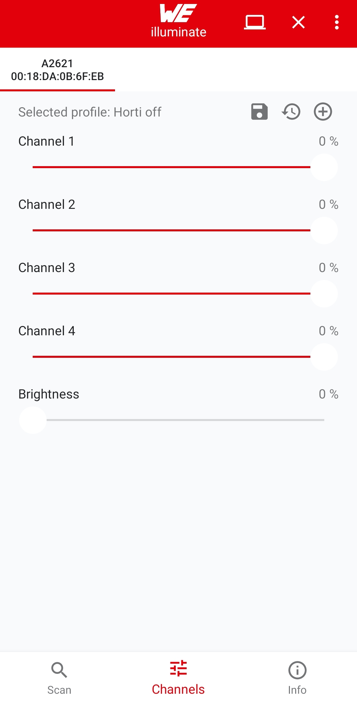

# WEilluminate

Contact: https://www.we-online.de/web/en/wuerth_elektronik/kontakte_weg/contacts_weg.php

Google Play Store: https://play.google.com/store/apps/details?id=com.eisos.android

## General information

This app is developed to control LED's for horticulture and color mixing applications.
Currently the app is under development, which means that bugs might occur.
Additional features and updates will be released as they are developed.

## Installation

It is highly recommended to uninstall an older version of the app or at least clear the storage
of the app before installing a new version.

Latest version: <a href="WEilluminate_v1.0.apk" download>WEilluminate_v1.0.apk</a>

## Known issues

* Under Android 10 there will be no callback when a scanned device is not available anymore.

## UI overview

Scan screen                                           | Device screen                                             | Info screen
:---------------------------------------------------: | :-------------------------------------------------------: | :---------------------------------------------------:
  |   | 

Profiles screen                                       | Create profile screen                                     | Device screen after profile selection
:---------------------------------------------------: | :-------------------------------------------------------: | :---------------------------------------------------:
  |   | 
